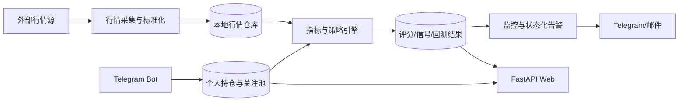

# 阶段 0：总体架构

状态：`COMPLETE`
完成日期：2026-07-18

## 目标

确定项目从监控脚本演进为个人量化研究平台的模块边界，避免策略、行情抓取、页面和通知继续耦合在同一循环中。

## 目标架构

## 模块边界

- `market_data`：获取、标准化、缓存行情，不理解买卖策略。
- `research`：指标、因子、回测、统计，不发送通知。
- `monitoring`：把最新行情、持仓和策略结果组合成告警状态。
- `web`：读取本地数据并展示，不直接访问 AKShare。
- `bot`：个人持仓和关注池管理入口。
- `infrastructure`：数据库、配置、备份、日志和部署。

## 关键决定

1. 单用户：`app.owner_user_id` 是唯一 Bot 所有者。
2. SQLite 优先：启用 WAL 和合理索引，先测量再决定是否换库。
3. 日线是研究基线：盘中价格只更新实时快照，不反复下载完整历史。
4. 回测和实时评分必须调用同一套纯策略函数。
5. “极致策略”定义为样本外稳定、风险可控和结果可解释，而不是指标数量最多。

## 已完成基础

- 单用户数据源和默认拒绝权限。
- 数据库原子更新与唯一约束。
- 持久化告警冷却。
- 配置校验、上海时区、日历范围保护。
- Ruff、自动化测试和 CI。

## 验收记录

- 18 项单元测试通过。
- Ruff、依赖检查、编译检查通过。
- SIGTERM 优雅退出烟雾测试通过。
